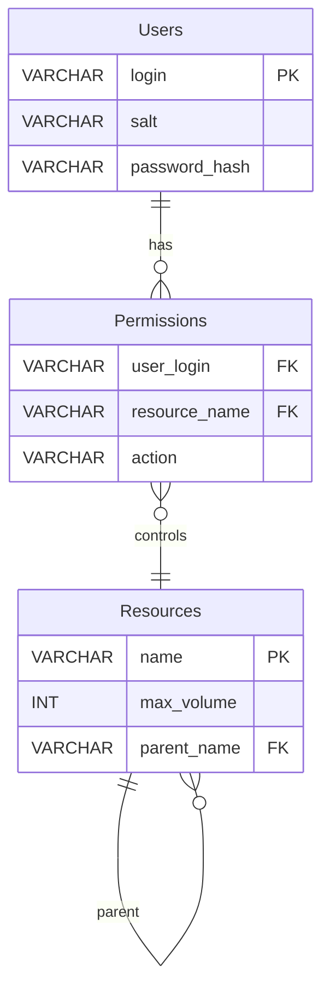

# План работы с базой данных

## 1. Сущности и их атрибуты

### Users

| Поле          | Тип     | Описание                    |
|---------------|---------|-----------------------------|
| login         | VARCHAR | Логин пользователя (PK)     |
| salt          | VARCHAR | Соль для хеширования пароля |
| password_hash | VARCHAR | Хэш пароля                  |

### Resources

| Поле        | Тип     | Описание                         |
|-------------|---------|----------------------------------|
| name        | VARCHAR | Название ресурса (PK)            |
| max_volume  | INT     | Максимальный доступный объём     |
| parent_name | VARCHAR | Родительский ресурс (FK на name) |

### Permissions

| Поле          | Тип     | Описание                               |
|---------------|---------|----------------------------------------|
| user_login    | VARCHAR | Логин пользователя (FK на Users.login) |
| resource_name | VARCHAR | Имя ресурса (FK на Resources.name)     |
| action        | VARCHAR | Действие (READ, WRITE, EXECUTE)        |

## 2. Связи между сущностями

- `Permissions.user_login → Users.login` (многие к одному)
- `Permissions.resource_name → Resources.name` (многие к одному)
- `Resources.parent_name → Resources.name` (рекурсивная связь для дерева ресурсов)

## 3. ER-диаграмма (Mermaid)

## 4. Техническая сторона

* СУБД: **H2 (файловая)**
* Подключение через **JDBC**: `DriverManager.getConnection("jdbc:h2:./src/main.kotlin.data/data_source/app-db", "sa", "")`
* Скрипты:
    * `scripts/initDb.sh` — создаёт базу и таблицы
    * `scripts/fill.sql` — наполняет таблицы начальными данными
* Все соединения и запросы обёрнуты в `use` для корректного закрытия

## 5. Планируемые изменения в коде

1. Созданы JDBC-реализации репозиториев:
    * `UserRepositoryImpl`
    * `ResourceRepositoryImpl`
    * `PermissionRepositoryImpl`
2. Функция `runApp()` в `Main.kt` переписана для работы с JDBC:
    * Подключение к базе через `DatabaseConnectionFactory`
    * Обработка кодов ошибок 9 (подключение) и 10 (SQL)
3. Use case’ы остаются без изменений — используют интерфейсы репозиториев
4. CommandLineParser остался прежним, отвечает только за разбор аргументов
